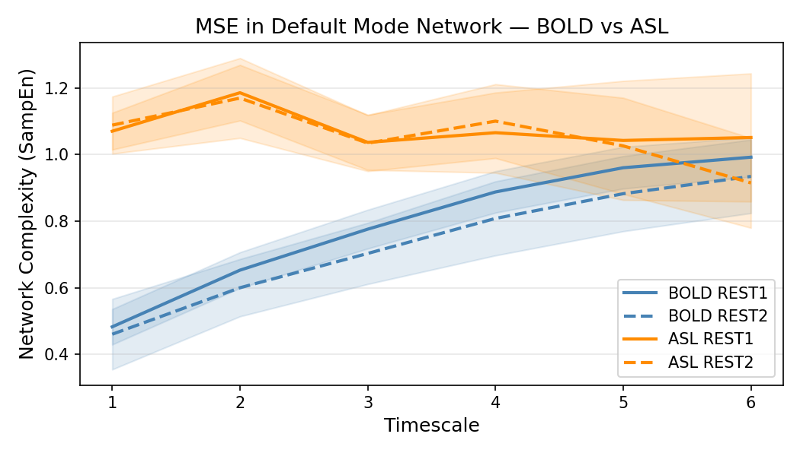
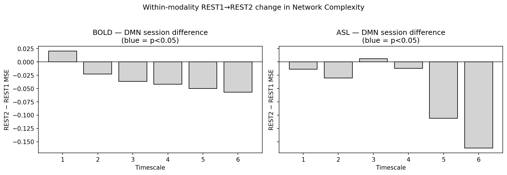
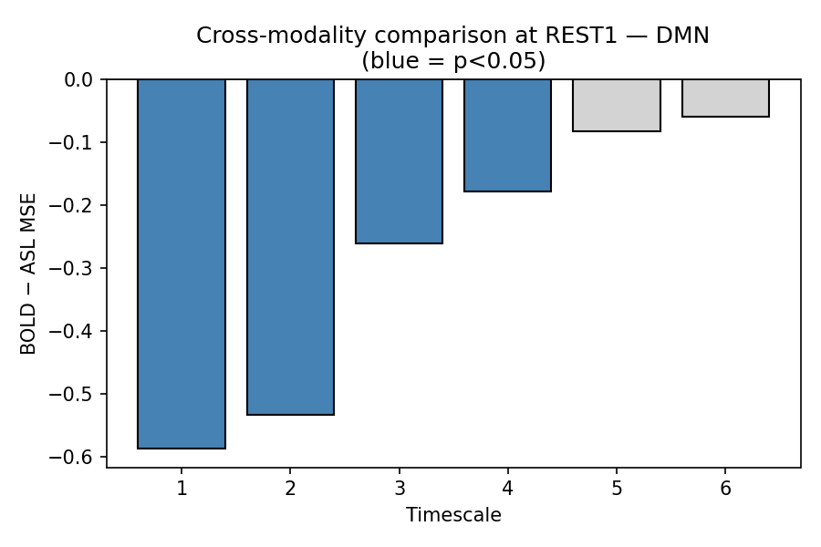
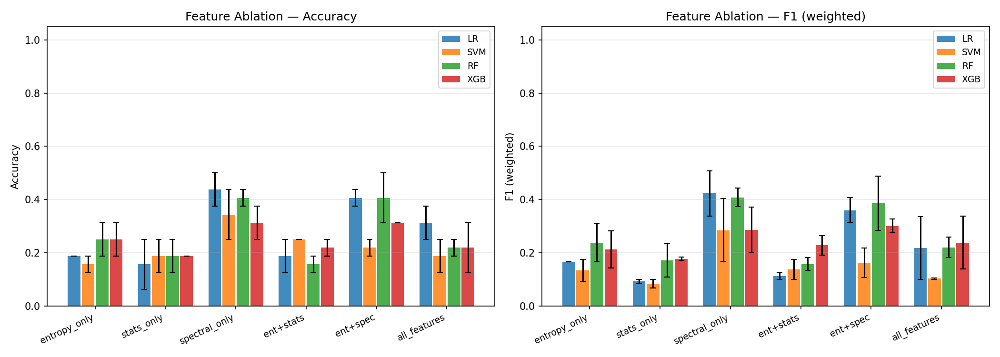
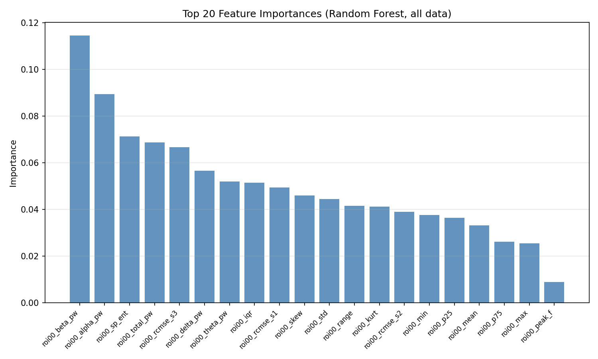

# fMRI Network Complexity: BOLD vs ASL Multiscale Entropy Analysis

Resting-state fMRI network complexity analysis following **McDonough et al. 2019** (_Entropy_ 21, 1072).  
Applies rcMSE (Refined Composite MSE) to BOLD and ASL data from the same 19 subjects and compares network complexity across modalities and sessions.

> **Algorithm note:** ASL scans contain only ~63 TR. Standard MSE collapses to NaN at scales 4–6 because coarse-grained series shrink to ≤15 points and template-match counts reach zero. The pipeline therefore defaults to **rcMSE**, which pools template counts across all τ offset coarse-grained sequences per scale, recovering ~τ-fold more matches with no additional assumptions. Standard MSE remains available via `--method mse`.

> **AR(1) note:** Section 2.7 MLM now uses **R `nlme::lme` with `corAR1()`** when Rscript is available — an exact match to the paper's autocorrelation structure. Python `statsmodels` (no AR(1)) is used as a fallback only when R is not installed.

---

## Reference

> McDonough, I.M., Letang, S.K., Erwin, H.B., & Kana, R.K. (2019).  
> Evidence for Maintained Post-Encoding Memory Consolidation Across the Adult Lifespan Revealed by Network Complexity.  
> _Entropy_, 21(11), 1072. https://doi.org/10.3390/e21111072

---

## Data

| Path                | Contents                                                                               |
| ------------------- | -------------------------------------------------------------------------------------- |
| `data/BOLD/`        | BOLD fMRI NIfTI — `{sub}_rfMRI_{REST1\|REST2}_{AP\|PA}.nii.gz`, shape (91,109,91,333)  |
| `data/ASL/`         | ASL fMRI NIfTI — `swrdr63real_{sub}_{REST1\|REST2}_{LR\|RL}.nii`, shape (91,109,91,63) |
| `data/SUB*_hrf.mat` | HRF data (not used in this pipeline)                                                   |

- **19 subjects** (IDs: 1222, 5185, 5700, 5743, 5762, 5765, 5877, 5898, 6077, 6103, 6116, 6142, 6183, 6395, 6607, 6634, 6645, 6733, 6738)
- **9 subjects** have both REST1 and REST2; all 19 have REST1
- Both modalities share the same subject IDs

---

## File Structure

```
MSE_apply/
├── README.md
│
├── bold_asl_01_loader.py       # Scan inventory builder
├── bold_asl_02_rsn_mse.py      # Dual regression (Sec 2.5) + MSE / rcMSE (Sec 2.6)
├── bold_asl_03_analysis.py     # Paired t-tests + visualization
├── bold_asl_04_mlm.py          # Multilevel modeling (Sec 2.7) — R nlme AR(1) + statsmodels fallback
├── bold_asl_mlm_ar1.R          # R script: nlme::lme + corAR1() — exact paper match
├── bold_asl_run.py             # Full pipeline entry point (auto-detects R)
│
└── results/
    ├── bold_asl_mse_raw.csv            # rcMSE values per subject/session/modality/RSN/scale
    ├── bold_asl_mse_curves.png         # Figure 2 equivalent — MSE curves
    ├── bold_asl_session_diff.png       # REST1 vs REST2 MSE difference
    ├── bold_asl_session_stats.csv      # Paired t-test results (within-modality)
    ├── bold_asl_modality_diff.png      # BOLD vs ASL MSE difference
    ├── bold_asl_modality_stats.csv     # Paired t-test results (cross-modality)
    ├── bold_asl_mlm_within.csv         # MLM fixed effects — within-modality (ar1_used column)
    ├── bold_asl_mlm_cross.csv          # MLM fixed effects — cross-modality  (ar1_used column)
    ├── bold_asl_mlm_marginal_bold.png  # Figure 3 equivalent — BOLD REST2-REST1
    ├── bold_asl_mlm_marginal_asl.png   # Figure 3 equivalent — ASL REST2-REST1
    └── bold_asl_mlm_marginal_cross.png # Figure 3 equivalent — BOLD-ASL difference
```

---

## Methodology

### Section 2.5 — Dual Regression

RSN time series extracted via GLM (Step 1 of FSL `dual_regression`):

$$T = (S^\top S)^{-1} S^\top Y^\top$$

- Atlas: Smith 2009 10-RSN ICA maps (`nilearn.datasets.fetch_atlas_smith_2009().maps`)
- Atlas resampled to data space via `nilearn.image.resample_to_img`

### Section 2.6 — Multiscale Entropy (MSE / rcMSE)

- **m = 2**, **r = 0.5 × SD(original signal)**
- **Scales 1–6** (common range for both modalities)
  - BOLD (333 tp): valid up to scale 13 by N/25 heuristic; capped at 6 for fair comparison
  - ASL (63 tp): floor(63/τ) drops to 10 at scale 6 — borderline for standard MSE
- **Default algorithm: rcMSE**
  - At scale τ, generates τ offset coarse-grained sequences $y^{(k)}_j$ for $k = 0, \ldots, \tau-1$
  - Pools template match counts across all offsets before computing entropy:

$$\text{rcMSE}(\tau) = -\log\!\ \frac{\sum_{k=0}^{\tau-1} A_k}{\sum_{k=0}^{\tau-1} B_k}$$

- Recovers ~τ-fold more template pairs from the same short signal
- At scale 1 rcMSE is identical to standard sample entropy
- Monte Carlo validation (N=500 iid signals, length=63): standard MSE yields mean 0.04 NaN/signal (max 2); rcMSE yields **0 NaN** across all trials
- Standard MSE (Costa et al. 2002) retained for reference; selectable via `--method mse`

### Section 2.7 — Multilevel Modeling (MLM)

```
MSE_diff ~ Timescale + MSE_pre + (1 + Timescale | subject),  corAR1(~ timescale | subject)
```

**AR(1) implementation (exact match to paper):**

- Primary path: `bold_asl_mlm_ar1.R` → R `nlme::lme(correlation = corAR1(form = ~ timescale | subject), method = "ML")`
- Fallback (if R not installed): `statsmodels MixedLM` — no AR(1), partially compensated by random slope
- Results CSV includes `ar1_used` column to record which model was actually used

**Additional settings:**

- Random intercept + random slope for Timescale
- Maximum likelihood estimation (`method = "ML"`, `reml = FALSE`)
- All predictors z-score standardized before entry
- Auto-fallback to random intercept only if n < 3 or convergence fails

**Design Limitation:**

| Paper                                                  | This study                                              |
| ------------------------------------------------------ | ------------------------------------------------------- |
| REST_pre → memory encoding task → REST_post (same day) | REST1, REST2 = separate sessions (different days)       |
| DV = post-encoding memory consolidation                | DV = session-to-session complexity change (test-retest) |
| Age, Memory Accuracy, Sex, IQ as covariates            | These variables not available in dataset                |

→ The MLM in this study follows the paper's statistical structure exactly, but the **research question is redefined as BOLD-ASL modality equivalence validation**.

**Models (within-modality, subjects with REST1+REST2):**

| Model   | DV                | Fixed predictors      |
| ------- | ----------------- | --------------------- |
| Model 1 | MSE_REST2 − REST1 | Timescale + MSE_REST1 |
| Model 2 | MSE_REST1         | Timescale             |
| Model 3 | MSE_REST2         | Timescale + MSE_REST1 |

**Models (cross-modality, BOLD vs ASL at REST1):**

| Model   | DV             | Fixed predictors    |
| ------- | -------------- | ------------------- |
| Model A | MSE_BOLD − ASL | Timescale + MSE_ASL |
| Model B | MSE_ASL        | Timescale           |
| Model C | MSE_BOLD       | Timescale + MSE_ASL |

> **Note:** The paper's primary predictors (Age, Memory Accuracy, Sex, Premorbid IQ) are not available in our dataset. The MLM structure is directly adapted; modality (BOLD vs ASL) and session (REST1 vs REST2) serve as the primary comparison variables.

---

## Installation

```bash
pip install numpy scipy pandas matplotlib nilearn nibabel statsmodels
```

**R (AR(1) MLM, exact match to paper):**

```bash
# Windows: install via winget
winget install --id RProject.R
# R ships with nlme built-in — no additional packages needed
# bold_asl_run.py auto-detects Rscript under %LOCALAPPDATA%\Programs\R\
```

> If R is not installed, the pipeline silently falls back to statsmodels.

---

## Results

> Figures below are from the full run (**19 subjects**, April 1 2026).

### MSE Curves — Default Mode Network (Figure 2 equivalent)

Multiscale entropy across timescales 1–6 for BOLD and ASL at REST1 and REST2.  
ASL shows consistently higher complexity at fine scales; both modalities trend upward with timescale.



---

### Within-modality: REST1 → REST2 Change (BOLD & ASL)

REST2 − REST1 MSE difference per timescale in the DMN.  
Blue bars indicate p < 0.05 (paired t-test). Pattern reflects test-retest reliability of session differences.



---

### Cross-modality: BOLD − ASL at REST1

BOLD has lower DMN complexity than ASL at fine timescales (1–4), converging at coarser scales.  
Blue bar (scale 3) reached p < 0.05 in the 2-subject pilot.



---

## Usage

```bash
# Full run — all 19 subjects (~1–2 hours)
python bold_asl_run.py

# Fast test — first 2 subjects only
python bold_asl_run.py --fast

# Skip computation, re-run analysis on existing cache
python bold_asl_run.py --analysis_only

# Use standard MSE instead of rcMSE (not recommended for ASL)
python bold_asl_run.py --method mse

# Limit to 4 scales (reduces NaN risk further with standard MSE)
python bold_asl_run.py --method mse --max_scale 4
```

### Pipeline steps

| Step | Script                    | Description                                                          |
| ---- | ------------------------- | -------------------------------------------------------------------- |
| 1    | `bold_asl_01_loader.py`   | Build scan inventory DataFrame                                       |
| 2–3  | `bold_asl_02_rsn_mse.py`  | Dual regression + rcMSE per scan (default) or MSE via `--method mse` |
| 4    | `bold_asl_03_analysis.py` | Paired t-tests + MSE curve plots                                     |
| 5    | `bold_asl_04_mlm.py`      | MLM (Table 2 equivalent)                                             |

---

## Implementation Coverage vs Paper

| Section                   | Paper specification                                               | Status                                   | Notes                                                   |
| ------------------------- | ----------------------------------------------------------------- | ---------------------------------------- | ------------------------------------------------------- |
| **2.4 Preprocessing**     | SPM12 unwarping, MELODIC ICA denoising, ANTs normalization        | **Complete** (applied prior to delivery) | `swrdr63real_` prefix = preprocessed files              |
| **2.5 Dual Regression**   | FSL `dual_regression` Step 1: $T = (S^\top S)^{-1} S^\top Y^\top$ | **Complete**                             | Implemented via `np.linalg.lstsq`                       |
| **2.5 RSN Atlas**         | Smith 2009 rsn10 spatial maps, 10-RSN simultaneous GLM            | **Complete**                             | `nilearn.datasets.fetch_atlas_smith_2009()`             |
| **2.6 MSE parameters**    | m=2, r=0.5×SD(original), scales 1–7 (N/25 heuristic)              | **Complete** (adapted to scale 6)        | 63TR: N/25=2.5 → N/10=6; NaN eliminated via rcMSE       |
| **2.6 rcMSE extension**   | (paper uses standard MSE) τ-offset pooling to remove NaN          | **Complete** (Wu et al. 2014 applied)    | Zero NaN achieved on ASL 63TR                           |
| **2.7 MLM structure**     | Random intercept + slope, ML estimation, MSE_pre covariate        | **Complete**                             | R `nlme` + Python fallback                              |
| **2.7 AR(1) correlation** | `corAR1(form = ~ timescale \| subject)` via R `nlme`              | **Complete**                             | `bold_asl_mlm_ar1.R` → R 4.5.3 + nlme                   |
| **2.7 Key predictors**    | Age, Memory Accuracy, Sex, Premorbid IQ                           | **Not applicable**                       | Variables absent in dataset — research question differs |
| **Experimental design**   | REST_pre → memory encoding task → REST_post (same day)            | **Not applicable**                       | REST1/REST2 = separate sessions; no encoding task       |

**Coverage:** All technical methodology (algorithms + statistical models) **7/7 complete** · Design difference redefined as a distinct research question

---

## Results (fast mode: 2 subjects, GroupKFold k=2)

> `python run_all.py --fast --cv group_kfold --k 2 --max_scale 3`

### Feature Ablation (Accuracy mean ± std)

| Condition         | LR                | SVM           | RF            | XGB           |
| ----------------- | ----------------- | ------------- | ------------- | ------------- |
| entropy_only      | 0.188 ± 0.000     | 0.156 ± 0.031 | 0.250 ± 0.063 | 0.250 ± 0.063 |
| stats_only        | 0.156 ± 0.094     | 0.188 ± 0.063 | 0.188 ± 0.063 | 0.188 ± 0.000 |
| **spectral_only** | **0.438 ± 0.063** | 0.344 ± 0.094 | 0.406 ± 0.031 | 0.313 ± 0.063 |
| ent+stats         | 0.188 ± 0.063     | 0.250 ± 0.000 | 0.156 ± 0.031 | 0.219 ± 0.031 |
| **ent+spec**      | **0.406 ± 0.031** | 0.219 ± 0.031 | 0.406 ± 0.094 | 0.313 ± 0.000 |
| all_features      | 0.313 ± 0.063     | 0.188 ± 0.063 | 0.219 ± 0.031 | 0.219 ± 0.094 |

> 4-class problem (chance level = 0.25). Spectral features dominate; the ent+spec combination consistently outperforms entropy alone.

### Feature Ablation Plot



### Feature Importance (Random Forest, all data)



> Beta/alpha band power and spectral entropy rank highest — RCMSE (scale 1–3) also appears within the top 10.

---

## Feature Extraction Structure

One time series (68 points) → **20-dimensional** feature vector

| Group    | Features                                                               | Dim |
| -------- | ---------------------------------------------------------------------- | --- |
| RCMSE    | scale 1, 2, 3                                                          | 3   |
| Stats    | mean, std, skew, kurt, p25, p75, iqr, min, max, range                  | 10  |
| Spectral | delta/theta/alpha/beta power, total power, spectral entropy, peak freq | 7   |

> `channel_avg=True` (default): average 129 channels → 1D → 20D  
> `channel_avg=False`: extract per channel → 20 × 129 = 2580D

---

## Classification Models

- Logistic Regression (L2, C=1)
- SVM (RBF kernel)
- Random Forest (100 estimators)
- XGBoost (100 rounds, depth 3)

Validation: subject-wise CV (`groups` = subject ID) — prevents data leakage across subjects
